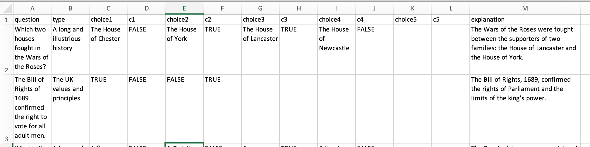
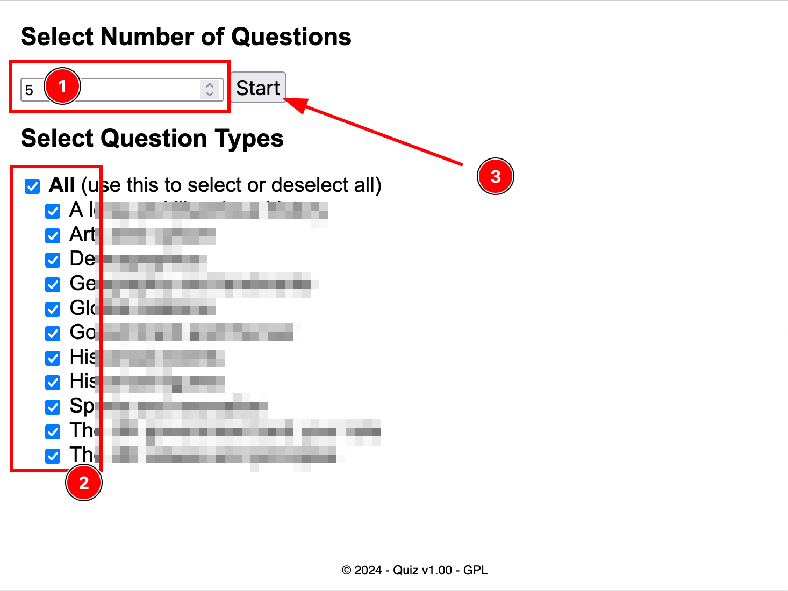
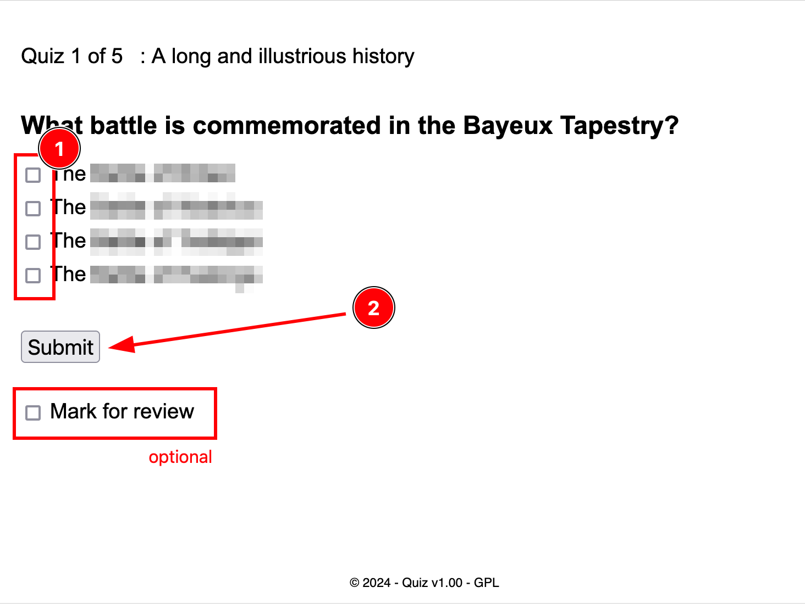
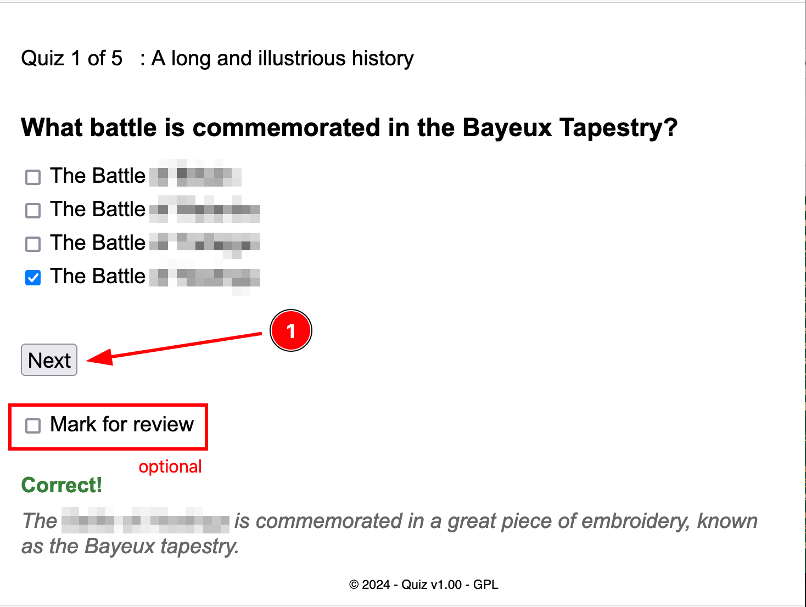
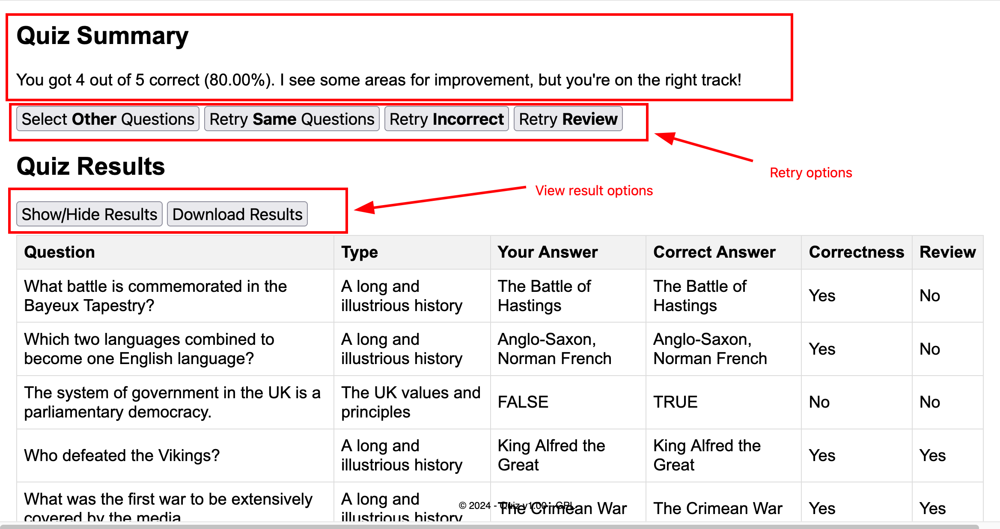

# Easy Quiz Maker   
This is a user-friendly web application that allows you to create short quizzes in a single HTML file. (<a href="https://barry-the-nerd.github.io/lituk" target="_blank">Click here for demo</a>) It's perfect for:   

* __Preparing for exams:__ Quickly set up quizzes to test your knowledge on any subject.
* __Sharing knowledge:__ Create quizzes and share them with friends or colleagues to test their understanding.
  
__Key Features:__  
* __Simple and Portable:__ The entire quiz is contained within a single HTML file, making it easy to copy, share, and use anywhere.
* __Flexible Question Types:__ Create multiple-choice questions with 2 to 5 answer options, explanations, and different question types to suit your needs.
* __Spreadsheet-based Editing:__ Edit your questions conveniently in a spreadsheet application (like Excel or Google Sheets) and then convert them to the format used by the program.
* __Review and Retry:__ Mark questions for review and allow users to retry incorrectly answered questions to improve their learning.
* __Test Results Summary:__ Get a clear overview of quiz results, including the ability to download them for reference.

This project provides a convenient and efficient way to create short quizzes by studnets, teachers, parents for various purposes.

## Installation
There are many ways to download the package. If you are not familiar with gitops, you can download from the [repository](https://github.com/barrychum/quiz-maker) and choose Download.zip from the menu.  Extract the files to a folder you select.  


## Configuration
The only file(s) you need to run the program is the index.html in the src subfolder.  You found 3 files in the src subfolder because I just want to keep the html file smaller and for easier update of the quiz questions by putting the questions in an external quizzes.js.  

You just need to put the index.html, the styles.css, the quizzes.js in the same folder.  Open the index.html by a browswer and you are good to go!  

To create your own quizzes.js, you can use 2 methods.  
1. Manually create the quizzes.js.  This is suitable for a quiz with small number of questions.  
2. Edit in a spreadsheet program and convert to quizzes.js.  This is the recommended method if you have a quiz with 10 or more questions.  

#### Method 1 : create quizzes.js manually
The quizzes.js file is a javascript file that contains 1 constant quizzes.  

const quizzes = [  
    {  
    "choices":[<span style="color: red;">"choice 1","choice 2","choice 3","choice 4"</span>],  
    "explanation":<span style="color: red;">"answer explanation"</span>,  
    "question":<span style="color: red;">"the question?"</span>,  
    "correct":[<span style="color: red;">0,1</span>],  
    "type":<span style="color: red;">"question type"</span>  
    },
    <span style="color: red;">...</span>
];  
#### Method 2 : convert a csv to quizzes.js
Use your favorite spreadsheet program (Excel / Goolge Sheets / LibreOffice Calc, etc) to create a worksheet with the following columns :  
| Column name | Description |
|---|---|
| question | The question |
| type | The question type.  If you don't use use this, you can simply put "General" |
| choice1 | The first answer choice. |
| c1 | if this is the correct answer, enter "true", otherwise, enter "false" |
| choice2 | similar to choice1 |
| c2 | similar to c1 |
| choice3 | similar to choice1. Leave blank if you don't need this |
| c3 | similar to c1. Leave blank if you don't need this |
| choice4 | similar to choice1. Leave blank if you don't need this |
| c4 | similar to c1. Leave blank if you don't need this |
| choice5 | similar to choice1. Leave blank if you don't need this |
| c5 | similar to c1. Leave blank if you don't need this |
| explanation | Enter the explanation for the answer |

The following is an example of the spreadsheet.  

After you have finished the spreadsheet, save the spreadsheet in a csv file using filename "quizzes.csv".  Use the utils/generate-quiz.ps1 to convert quizzes.csv to quizzes.js.

```
./generate-quiz.ps1 quizzes.csv quizzes.js
```
After you have generated the quizzes.js, just put the quizzes.js in the same directory as index.html and styles.css.  Open index.html from your favorite browser.  You are good to go.  
#### Method 3 : convert a csv to quizzes.js web tool
This is very similar to method 2.  I've created a html which you can run using a browser.  Just open the convert-quiz.html in the utils folder of this package using browser.  Import the csv file and save the converted quizzes.js.  Save the quizzes.js in the same directory as index.html and styles.css.

## Usage and Features:
The interface should be quite intuitive.  
#### Step 1 : Select questions
* Enter the number of questions you want to take.  
* Select the type of questions.
* Click <b>Start</b> button.


#### Step 2 : Answer questions
* Select the checkbox(es) of your answer
* Click <b>Submit</b> to submit your answer


#### Step 3 : View answers
* Select <b>Mark for review</b> if you want to review the question at the end of the quiz.
* Click <b>Next</b> for the next question.


#### Step 4 : Review quiz results
* When you finish the quiz, a summary and result will be shown.  You can download the result in csv format.
* Choose one of the options
    * Select Other questions : The program will restart and let you choose other questions.
    * Retry Same questions : The program will restart with the same set of questions in the quiz.
    * Retry Incorrect : The program will let you retry the questions that you did not answer correctly.  This option only appears if you have answered any questions incorrectly.
    * Retry Review : The program will let you retry the questions that you have marked for review.  This option only appears if you have marked any questions for review.
 


## License:
Easy Quiz Maker is licensed under the GNU General Public License v3.0 (GPLv3). This license grants you the freedom to use, modify, and distribute the code for any purpose. You can find the full license text in the [GNU General Public License v3.0](LICENSE)

## Author:
This program is created by me, Barry, for the personal need to prepare for examinations.  You can find me on Linkedin.
    
## Further Development
This is a very small personal project.  The current version should have sufficient features and functions for my personal needs.  In case you find this project useful, and you would like some features to be added, please feel free to contact me. You can find my profile in Linkedln.
