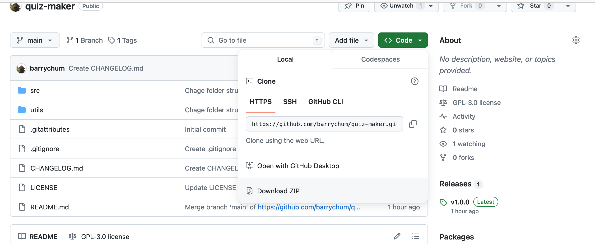

# Easy Quiz Maker 
 

Easy Quiz Maker is a user-friendly web application that allows you to create and take short quizzes in a single HTML file. [Try the demo](https://nerd-vana.github.io/lituk/)

## Features

- **Simple and Portable:** Only 3 files needed. No server-side dependencies, making it easy to copy, share, and use anywhere.
- **Flexible Question Types:** Create multiple-choice questions with 2 to 5 answer options, explanations, and different question types.
- **Spreadsheet-based Editing:** Edit questions conveniently in a spreadsheet application (like Excel or Google Sheets) and convert them to the required format.
- **Review and Retry:** Mark questions for review and retry incorrectly answered questions to improve learning.
- **Test Results Summary:** Get a clear overview of quiz results, with the option to download for reference.

## Use Cases

- **Exam Preparation:** Quickly set up quizzes to test knowledge on any subject.
- **Knowledge Sharing:** Create quizzes to test understanding of friends or colleagues.
- **Self-Assessment:** Use for personal learning and progress tracking.

## Installation

1. Visit the [repository](https://github.com/barrychum/quiz-maker).
2. Click "Code" and select "Download ZIP".
3. Extract the files to your preferred folder.



## Configuration

You only need three files from the `src` folder:
- `index.html`
- `styles.css`
- `quizzes.js`

Place these files in the same folder and open `index.html` in a browser to start.

### Creating quizzes.js

Two methods are available:

1. **Manual Creation:** Suitable for quizzes with few questions.
2. **Spreadsheet Conversion:** Recommended for quizzes with 10+ questions.

#### Method 1: Manual Creation

Edit `quizzes.js` directly. The file should contain a constant `quizzes` array:

```javascript
const quizzes = [
  {
    "choices": ["choice 1", "choice 2", "choice 3", "choice 4"],
    "explanation": "answer explanation",
    "question": "the question?",
    "correct": [0, 1],
    "type": "question type"
  },
  // ... more questions
];
```

#### Method 2: Spreadsheet Conversion

1. Create a spreadsheet with these columns:

   | Column | Description |
   |--------|-------------|
   | question | The question text |
   | type | Question type (use "General" if not specified) |
   | choice1-5 | Answer choices |
   | c1-5 | Correct answer flags ("true" or "false") |
   | explanation | Answer explanation |

2. Save the spreadsheet as "quizzes.csv".
3. Use `utils/generate-quiz.ps1` to convert:

   ```
   ./generate-quiz.ps1 quizzes.csv quizzes.js
   ```


#### Method 3: Web-based Conversion

Use the `convert-quiz.html` in the `utils` folder to convert your CSV file to `quizzes.js` directly in your browser.

## Usage

1. **Select Questions:**
   - Enter the number of questions.
   - Choose question types.
   - Click "Start".

   

2. **Answer Questions:**
   - Select answer(s).
   - Click "Submit".

   

3. **View Answers:**
   - Optionally mark for review.
   - Click "Next" for the next question.

   

4. **Review Results:**
   - View summary and download results.
   - Choose to retry or select new questions.

   

5. **Resume Quiz:**
   - Use "Resume Last Quiz" to continue an interrupted session.

   

## Future Development

While the current version meets my personal needs, I'm open to suggestions for new features. 
 
